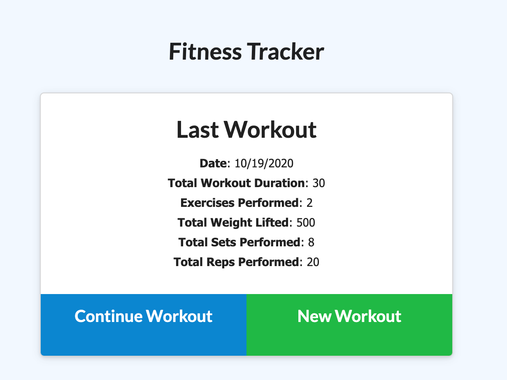
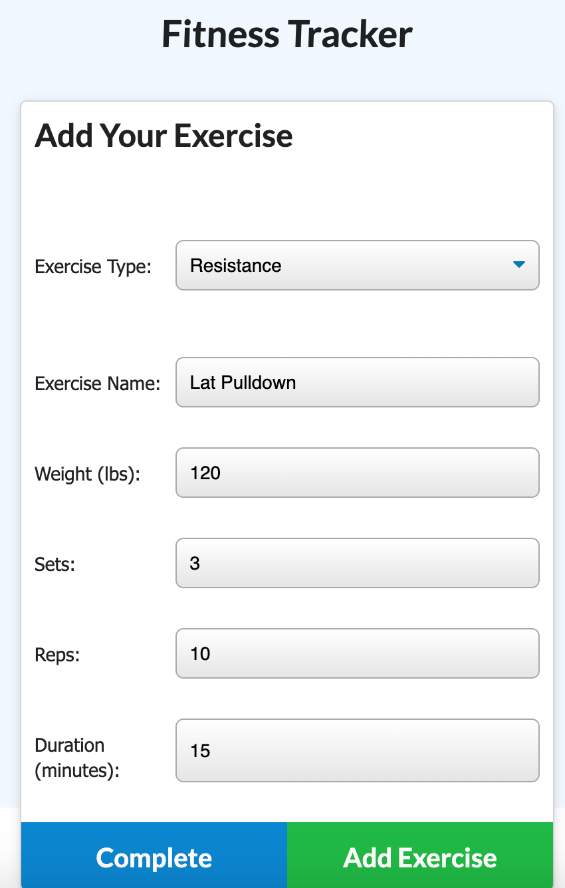
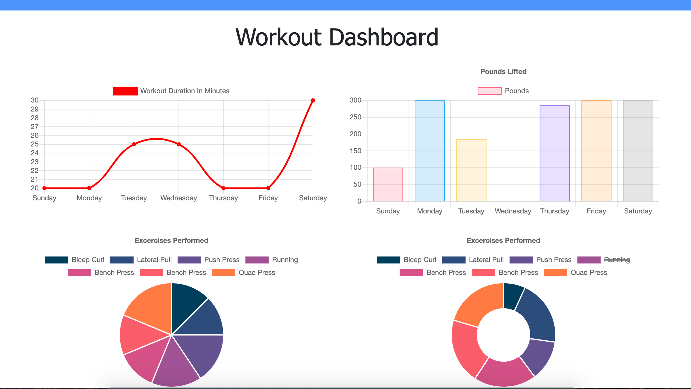

# NoSQL -- Workout Tracker
[](https://opensource.org/licenses/ISC)

## Description

Workout tracker app allows user to view, create, and track daily workouts. User is able to view workout or create new workouts to track. A dashboard with details of the workouts per day tracked is displayed in several graphs and charts to show the varying progress of the workouts.

A mongo database is created to keep track of all the results using mongoose schema and html and api routes are handled using expressjs.

## Screenshot Previews








## Installation

Before starting, install all dependencies detailed in package.json file

Run the seed file inside seeders folder to prepopulate data into the tracker

To connect via localhost run node for server.js file

```shell
npm i

node run seed

node server.js
```

## Usage

- User is able to add exercises to a previous workout plan
- User is able to add new exercises to a new workout plan
- User is able to view the combined weight of multiple exercises on the stats page
- When you click on Dashboard you are show chart data of workout that is being tracked


## Attributes

* MongoDB
* Mongoose
* Expressjs
* Github
* Heroku
* MongoDB Atlas


## Links
Heroku link - <a href="https://fitness-tracker-app-by-sey.herokuapp.com/" target="_blank">https://fitness-tracker-app-by-sey.herokuapp.com/</a>

## License
ISC License

---
Copyright Ⓒ 2020 Seychelle Koplik
